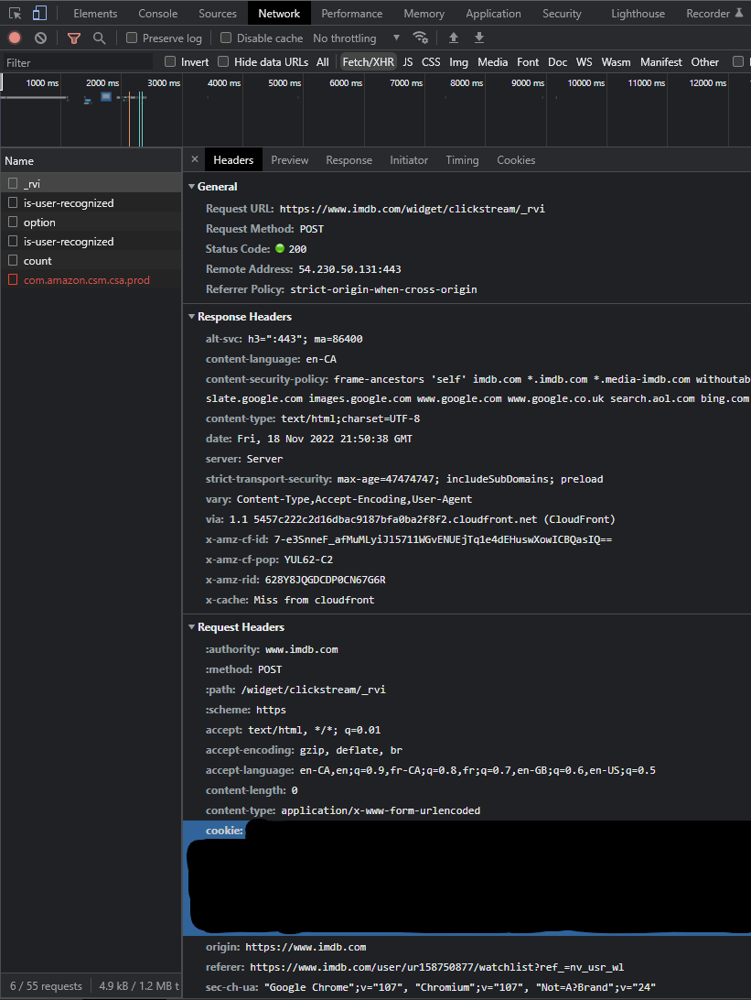

# imdb_transfer
Simple Python script to transfer ratings and the watchlist from one IMDb account to another

## usage
```
usage: imdbtransfer.py [-h] -c COOKIE [-r RATINGS] [-w WATCHLIST]

Imports IMDb ratings and watchlist from another account

optional arguments:
  -h, --help    show this help message and exit
  -c COOKIE     Cookie of the destination IMDb account
  -r RATINGS    ratings.csv from the originating IMDb account
  -w WATCHLIST  watchlist.csv of the originating IMDb account
```

The script creates a `done.json` file if the rate limit is exceeded, next run the script continues from where it left.

## get the ratings and watchlist

Export as csv the ratings and/or the watchlist from the originating IMDb account. Do not touch the content.

## get the IMDB cookie

The IMDb authentication token is the value of a cookie named at-main. Save it a a file for the `-c` option.<br>
It can be obtained by opening imdb.com in a browser, log in, then get it from:

(Chrome/Edge) DevTools > Application > Cookies<br>
(Safari/Firefox) DevTools > Storage > Cookies

Example in Chrome: 
